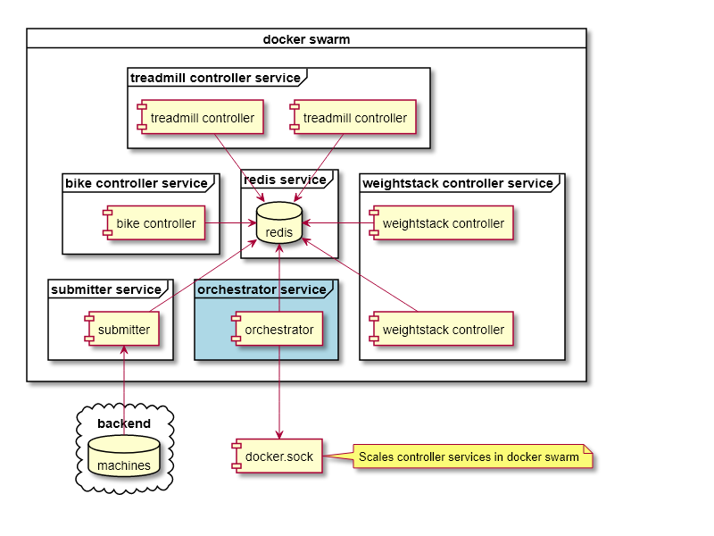

# SmartGym Gateway Orchestrator

SmartGym Gateway Orchestrator is responsible for

1. Ensuring the correct number of controllers containers for each exercise type
1. Assigning machine ID to each container

Desired number of exercise controller is retrieved from local redis.

## System Diagram

## Reference

All controllers starts off with 0 replicas.

### Scaling up from 0 to X

The orchestrator observes the number of controllers needed as declared by the submitter. The orchestrator then scales the controllers to the desired numbers required and assigns machine ID to each of them.

### Scaling down from X to X-1

While it is possible to exactly locate the container ID that was assigned a specific machine ID, it is impossible to scale down exactly that container. This is because scaling services is handled by docker swarm and the developers have no control over _which_ container is to be scaled down.

As such, the approach taken is to scale the affected service down to 0 replicas first. At the next orchestrator cycle, it would then be scaled up to the desired X-1 in a way similar to that described in `Scaling up from 0 to X`.

The effect is that, when scaling down, all containers in the service loses their state. There will be a temporary disruption to the service. Therefore, it is recommended to perform scale down operations only during scheduled downtime.
